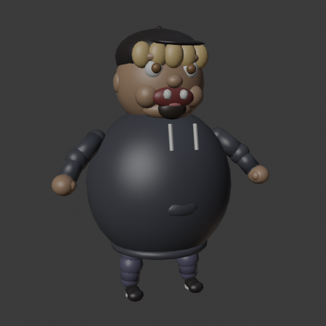
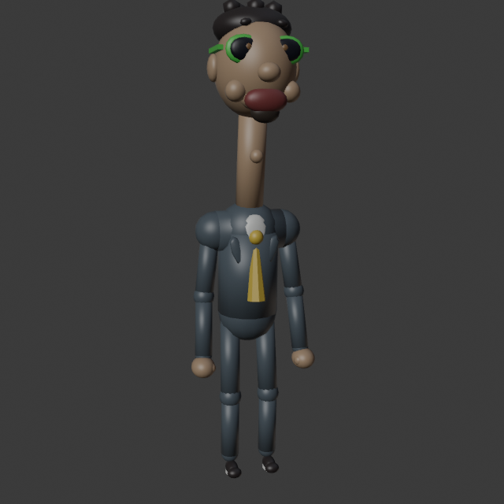
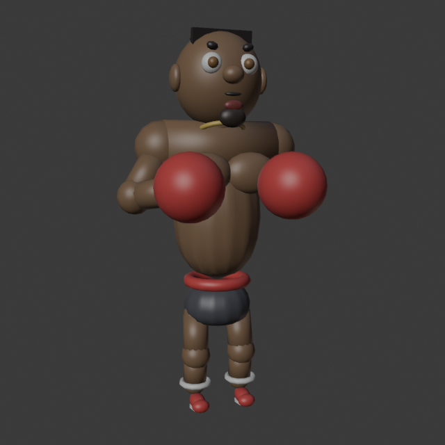
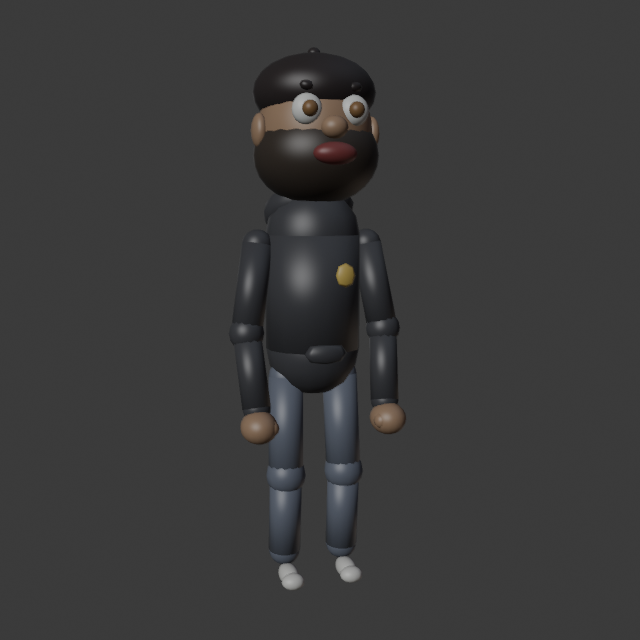
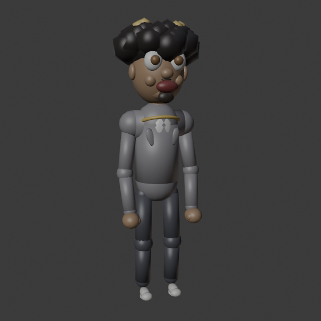

# 3D Tavern Migration

The game moved from the flat UI test scene to a stylized 3D **medieval tavern** lobby/game
room — cozy, warm, wooden, funny-not-realistic (Liar's-Bar-adjacent). All art is generated
procedurally in Blender (`blender/`, run `blender --background --python blender/build_all.py`)
and assembled in Unity via **Say Again ▸ Build 3D Tavern Scene**
(`unity/Assets/Editor/TavernSceneBuilder.cs`) into `Assets/Scenes/Tavern.unity`.

Branch: `feature/3d-world` (off `multiplayer`, which is left untouched).

## In-engine result

Warm candle/fire/lantern point lighting (positions from `tavern_lights.json`), a circular
table with exactly four seats + seated players (AJ, the fifth avatar, chats with the
announcer at the bar), wooden beams, hanging lantern, shelves of bottles, barrels. High 3/4
overview camera frames the whole table and keeps its centre clear for future game UI.

## Blender assembly (hero shot)

## Cast — the Beta Squad avatars

Humorous stylized caricatures built from the reference photos in the repo root
(`Chunkz.jpeg`, `Niko.jpeg`, `Kenny.jpeg`, `sharks.jpeg`, `AJ.jpeg`) — exaggerated
cartoon avatars, not realistic likenesses. Five avatars; four seat at the table,
the fifth hangs out at the bar in the lobby scene.

| | Avatar | Signature features |
|---|-----------|-----------|
| P1 | **Chunkz** |  huge round body, **teeth gap**, black hoodie, black cap with blonde wig fringe, chin beard |
| P2 | **Niko** |  giraffe neck + toggleable **stinky breath** (press **B**), **green sunglasses**, suit + gold tie |
| P3 | **Kenny** |  lean boxer, shirtless + gold chain, **razor-sharp pushed-back hairline**, red gloves, goatee |
| P4 | **Sharky** |  backwards black cap, **full beard**, black hoodie with gold patch |
| P5 | **AJ** |  big **Somali curls with golden tips**, blazer + white shirt, chain, goatee |
| — | **Announcer Host** |  larger-than-life barkeep, handlebar mustache, monocle, bowtie, frothy mug toast |

## Notes / next steps

- Assets are **stylized low-poly and game-ready** (props 90–300 faces, room ~2.9k, characters
  ~6–8k with full cartoon faces — iris/highlight/lids/brows/nose/ears/teeth — capsule limbs
  with joints, hands, shoes, and clothing details), with transforms applied, origins placed,
  UV-unwrapped, at a consistent 1u = 1m scale. Rigging / animation are the natural follow-up;
  body parts are kept as separate meshes (Head/Neck/Torso/Arms/Legs) for exactly that.
- Stinky breath is a toggle on Niko's baked `BadBreath` mesh (`BadBreathToggle` component,
  key **B**); swap in a particle system later for a livelier puff.
- Built-in render pipeline. If a model imports untextured, select its FBX → **Materials** →
  set Material Creation Mode to *Standard* and *Extract Materials* (batch import already maps
  the Blender colors, verified in the render above).
