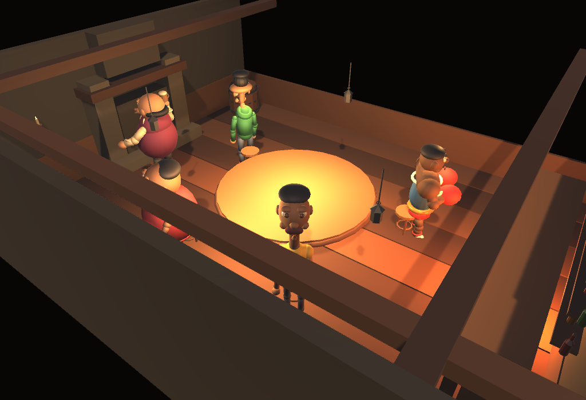
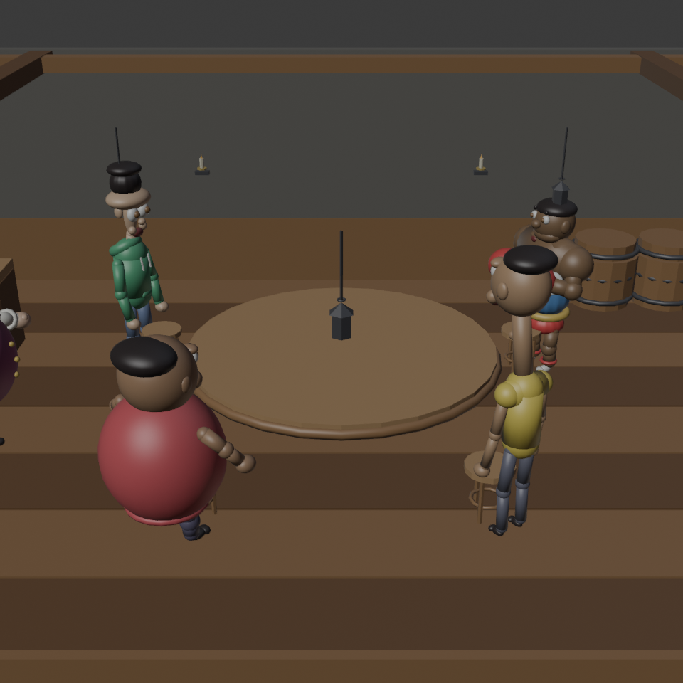
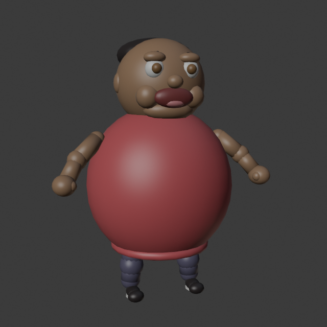
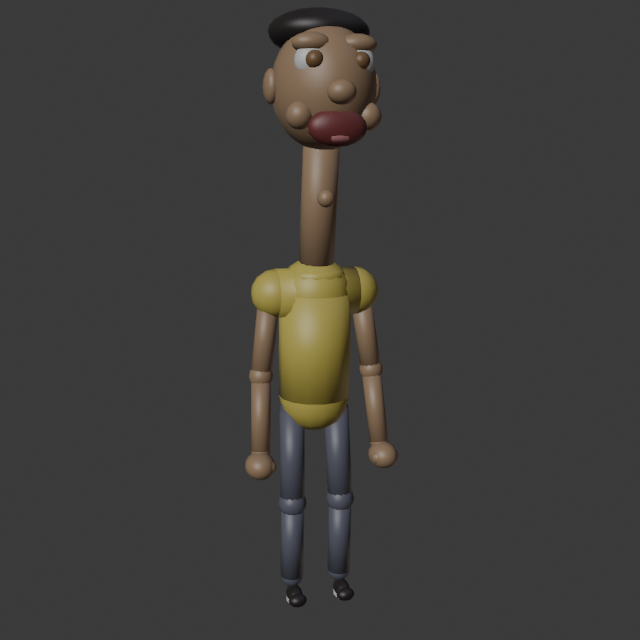
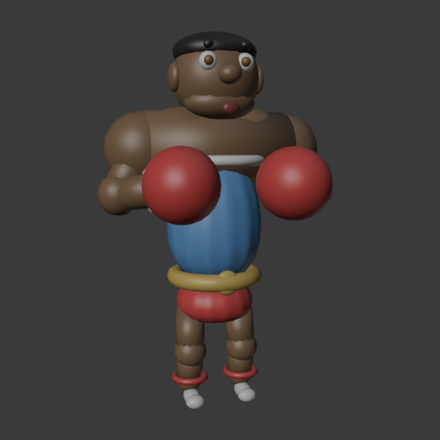
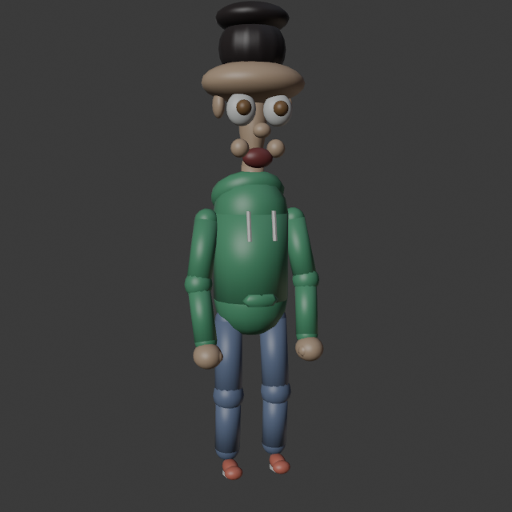
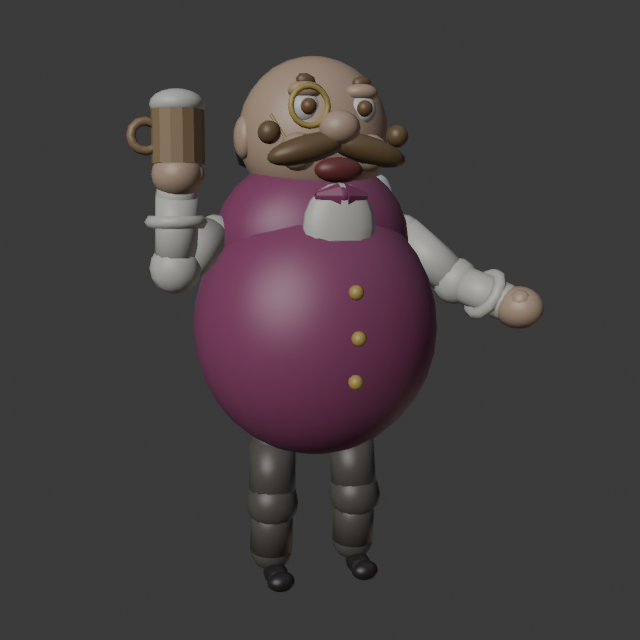

# 3D Tavern Migration

The game moved from the flat UI test scene to a stylized 3D **medieval tavern** lobby/game
room — cozy, warm, wooden, funny-not-realistic (Liar's-Bar-adjacent). All art is generated
procedurally in Blender (`blender/`, run `blender --background --python blender/build_all.py`)
and assembled in Unity via **Say Again ▸ Build 3D Tavern Scene**
(`unity/Assets/Editor/TavernSceneBuilder.cs`) into `Assets/Scenes/Tavern.unity`.

Branch: `feature/3d-world` (off `multiplayer`, which is left untouched).

## In-engine result

Warm candle/fire/lantern point lighting (positions from `tavern_lights.json`), a circular
table with exactly four seats + players, the announcer behind the bar, wooden beams, hanging
lantern, shelves of bottles, barrels. High 3/4 overview camera frames all four players and
keeps the table centre clear for future game UI.

## Blender assembly (hero shot)

## Cast

| | Character | Silhouette |
|---|-----------|-----------|
| P1 | **The Sphere** |  near-spherical body, tiny limbs, receding hairline, big grin |
| P2 | **The Giraffe** |  long neck, skinny, goofy grin, toggleable green bad breath (press **B**) |
| P3 | **The Boxer** |  huge shoulders, thick red gloves, confident/clueless |
| P4 | **The Slice** |  pizza-wedge head / pointed jaw, wide eyes, tall hair |
| — | **Announcer Host** |  larger-than-life barkeep, handlebar mustache, apron, frothy mug |

## Notes / next steps

- Assets are **stylized low-poly and game-ready** (props 90–300 faces, room ~2.9k, characters
  ~6–8k with full cartoon faces — iris/highlight/lids/brows/nose/ears/teeth — capsule limbs
  with joints, hands, shoes, and clothing details), with transforms applied, origins placed,
  UV-unwrapped, at a consistent 1u = 1m scale. Rigging / animation are the natural follow-up;
  body parts are kept as separate meshes (Head/Neck/Torso/Arms/Legs) for exactly that.
- Bad breath is a toggle on the giraffe's baked `BadBreath` mesh (`BadBreathToggle` component,
  key **B**); swap in a particle system later for a livelier puff.
- Built-in render pipeline. If a model imports untextured, select its FBX → **Materials** →
  set Material Creation Mode to *Standard* and *Extract Materials* (batch import already maps
  the Blender colors, verified in the render above).
