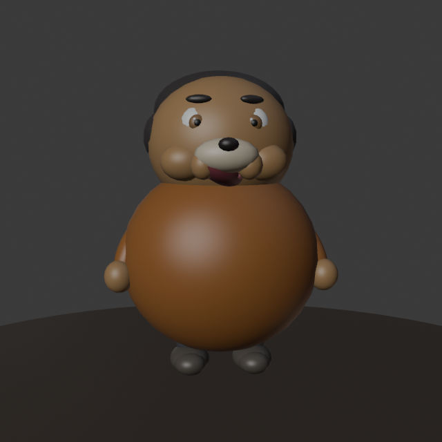
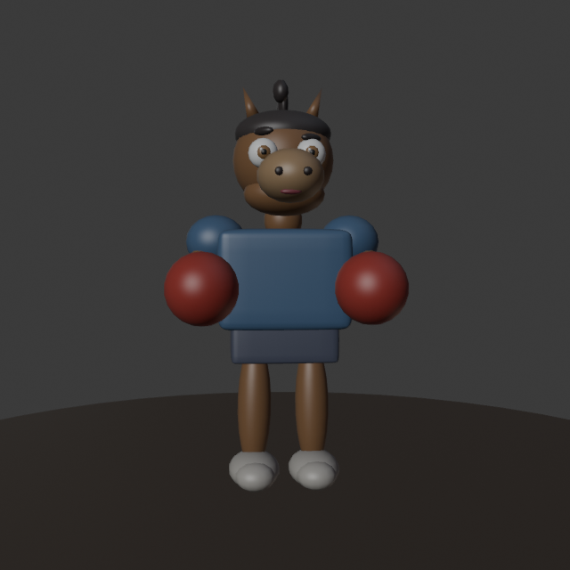
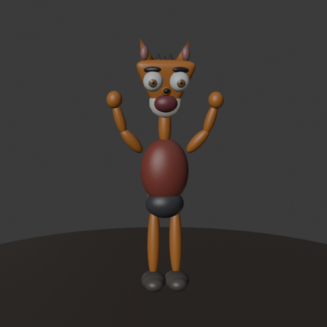
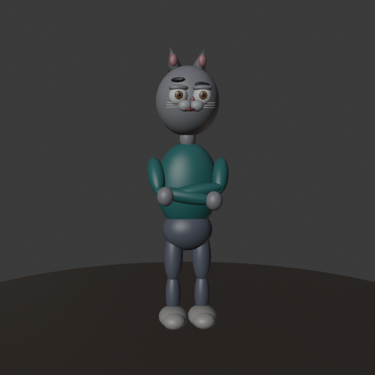

# 3D Tavern Migration

The game moved from the flat UI test scene to a stylized 3D **medieval tavern** lobby/game
room — cozy, warm, wooden, funny-not-realistic (Liar's-Bar-adjacent). The environment (room,
table, stools, barrels, lighting) is generated procedurally in Blender (`blender/`, run
`blender --background --python blender/build_all.py`). The **character cast** is a set of
Meshy.ai animal models (source GLBs in `meshy_src/`), normalized and exported to FBX by
`blender/import_meshy.py`. Everything is assembled in Unity via **Say Again ▸ Build 3D Tavern
Scene** (`unity/Assets/Editor/TavernSceneBuilder.cs`) into `Assets/Scenes/Tavern.unity`.

Branch: `feature/3d-world` (off `multiplayer`, which is left untouched).

## In-engine result

Warm candle/fire/lantern point lighting (positions from `tavern_lights.json`), a circular
table with exactly four seats + seated players (the cat, fifth avatar, chats with the penguin
announcer at the bar), wooden beams, hanging lantern, shelves of bottles, barrels. High 3/4
overview camera frames the whole table and keeps its centre clear for future game UI.

## Blender assembly (hero shot)

## Cast — Liar's Bar-style animal characters

A stylized animal cast (Meshy.ai models). Six characters; four seat at the table, the cat
hangs out at the bar with the penguin announcer. Slots keep the `P#_` naming so the scene
builder wiring is stable.

| | Avatar | Slot role | Features |
|---|-----------|-----------|----------|
| P1 | 🐶 **Bulldog** | seated | huge round body, tiny limbs |
| P2 | 🦒 **Giraffe** | seated | long neck, goofy grin, toggleable **stinky breath** (press **B**) |
| P3 | 🐴 **Horse** | seated | boxer with big **red gloves**, blue tank |
| P4 | 🦊 **Fox** | seated | orange, wide eyes, arms-up pose |
| P5 | 🐱 **Cat** | at the bar | grey, teal shirt, whiskers |
| — | 🐧 **Penguin** | announcer/host | top hat, red bowtie, holding a mic |

Front-of-model previews:   
  

## Pipeline notes

- **Source → game:** `meshy_src/*.glb` → `blender/import_meshy.py` (feet-to-origin, uniform
  0.75 scale into 1u=1m world, transforms **baked**, giraffe gets a `BadBreath` puff) →
  `unity/Assets/Art/Characters/generated/*.fbx` → scene builder.
- Baking transforms is critical: Meshy GLBs carry unapplied scale, and without baking Unity's
  FBX unit handling shrinks them to ~2cm and they vanish. `import_meshy.py` joins + applies
  everything so object transforms are identity, like the old procedural models.
- Heights after normalization: bulldog 1.88 m, giraffe 2.26 m, horse 1.82 m, fox 1.93 m,
  cat 1.99 m, penguin 1.81 m; ~8–13k tris each (game-ready for multiplayer).
- Stinky breath is a toggle on the giraffe's baked `BadBreath` mesh (`BadBreathToggle`
  component, key **B**); swap in a particle system later for a livelier puff.
- The old procedural Beta Squad caricatures (`gen_characters.py`) are kept in `blender/` as
  history/fallback but are no longer the shipping cast.
- **Next step:** these T-pose-ish models are ready for rigging + idle animations (breathing,
  head bobs, giraffe neck sway) — the biggest remaining quality jump.
